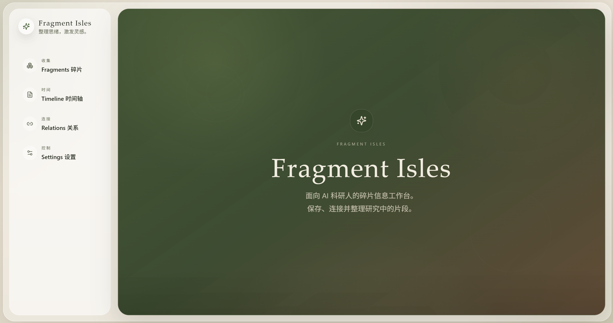
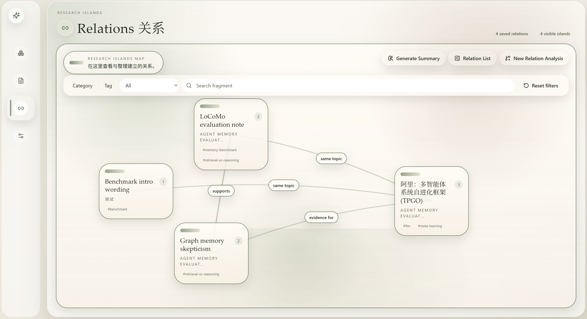

# Fragment Isles

Fragment Isles碎片群岛，帮助研究者收集、整理、关联和总结散落的碎片化信息。





## 工具定位

研究过程中，论文笔记、博客摘录、灵感想法、会议记录、deadline 散落在各处——信息量大、碎片化严重、彼此之间的关联难以梳理。Fragment Isles 正是为这种"信息太多，无从下手"的困境而设计：

- 快速收集各类碎片信息，降低整理门槛
- AI 辅助分类、打标签、发现关联，让碎片之间的结构浮现出来
- 用户掌握最终控制权，所有 AI 操作需手动触发，不会后台消耗 API
- 按需生成结构化总结，将零散碎片转化为可用的研究素材
- 本地优先，数据存储在浏览器 IndexedDB 中

## 功能

- **Fragments 碎片管理** — 创建、编辑、搜索、分类、标签管理，支持 AI 分析
- **Timeline 时间轴** — 从碎片中提取时间事件，可视化时间线
- **Relations 关系图** — AI 辅助发现碎片间的关联，可视化关系网络
- **Summary 总结生成** — 基于选定碎片生成结构化总结（总结 + Digest + 新Idea）
- **Markdown 导出** — 支持导出和复制 Markdown 格式内容

## 技术栈

- React 18 + TypeScript + Vite
- Tailwind CSS + Framer Motion
- Dexie.js (IndexedDB)

## 快速开始

```bash
# 安装依赖
npm install

# 启动开发服务器
npm run dev
```

浏览器打开 http://localhost:5173 即可使用。

## 构建部署

```bash
# 构建生产版本
npm run build

# 本地预览构建产物
npm run preview
```

构建产物在 `dist/` 目录下，可部署到任意静态托管服务。

## AI 配置

进入 Settings 页面，填写：
- API Base URL（OpenAI 兼容接口地址）
- API Key
- Model Name

所有 AI 调用都需要用户手动触发并确认费用后才会执行。

## 未来规划

- 网页链接导入（粘贴 URL 自动抓取内容）
- Zotero / BibTeX 文献导入
- 图片 OCR / 多模态理解
- Tauri 桌面端打包（Windows / macOS）
- 日历集成与提醒同步
